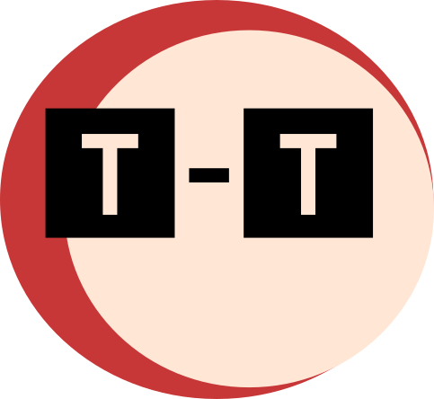
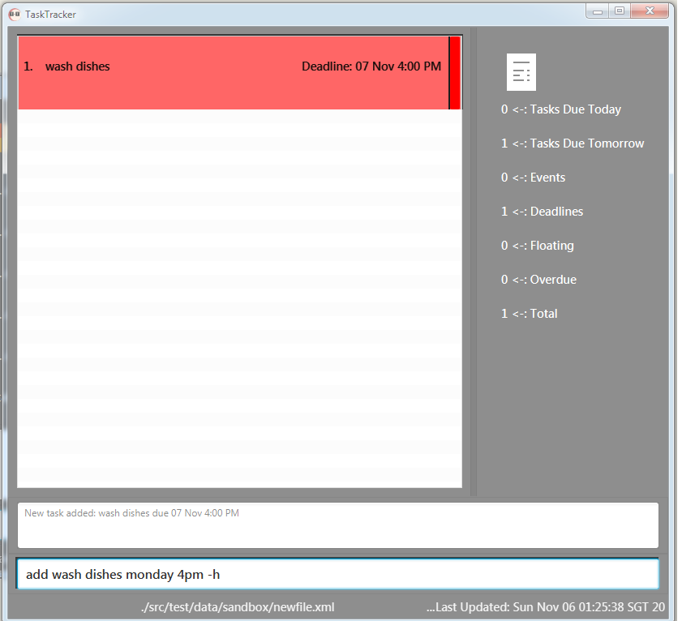
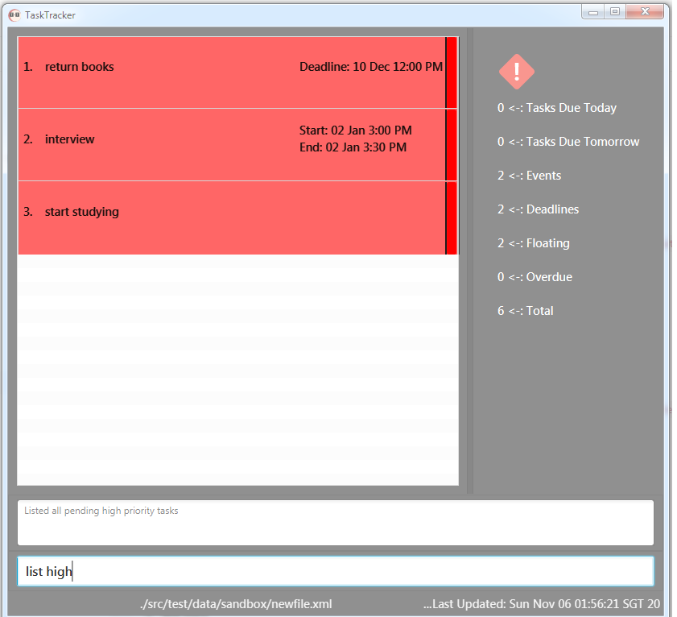
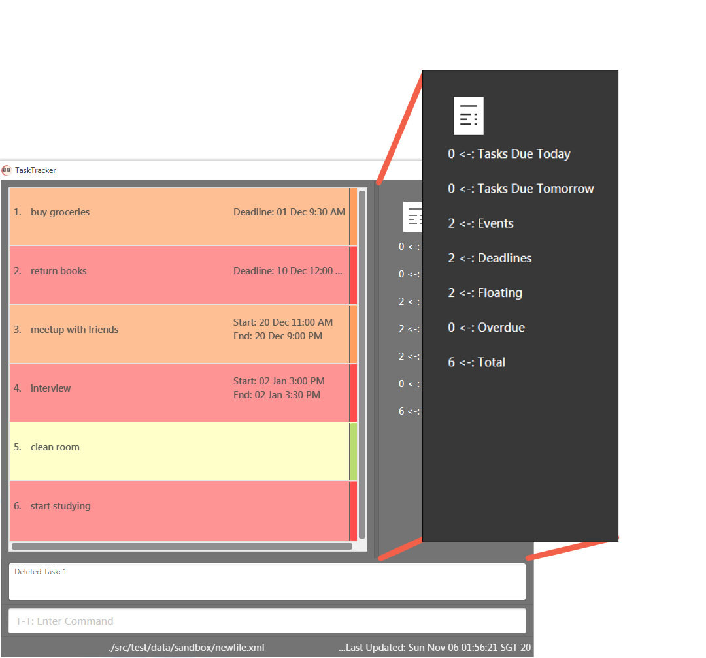

<!--@@author A0139422J -->

# **USER GUIDE** 
---
##**Contents**
*   [About](https://github.com/CS2103AUG2016-T09-C3/main/blob/documents/docs/UserGuide.md#about)
*   [Quick Start](https://github.com/CS2103AUG2016-T09-C3/main/blob/documents/docs/UserGuide.md#quick-start)
*   [Commands](https://github.com/CS2103AUG2016-T09-C3/main/blob/documents/docs/UserGuide.md#commands)
    -   [Add a Task](https://github.com/CS2103AUG2016-T09-C3/main/blob/documents/docs/UserGuide.md#1-add-a-task)
    -   [Edit a Task](https://github.com/CS2103AUG2016-T09-C3/main/blob/documents/docs/UserGuide.md#2-edit-a-task)
    -   [Delete a Task](https://github.com/CS2103AUG2016-T09-C3/main/blob/documents/docs/UserGuide.md#3-delete-a-task)
    -   [List Tasks](https://github.com/CS2103AUG2016-T09-C3/main/blob/documents/docs/UserGuide.md#4-list-tasks)
    -   [Help Command](https://github.com/CS2103AUG2016-T09-C3/main/blob/documents/docs/UserGuide.md#5-help-command)
*   [List Statistics](#liststatistics)
*   [Cheat Sheet](https://github.com/CS2103AUG2016-T09-C3/main/blob/documents/docs/UserGuide.md#liststatistics)
*   [FAQ](https://github.com/CS2103AUG2016-T09-C3/main/blob/documents/docs/UserGuide.md#liststatistics)

## **About**

**_Task Tracker_ (T-T)** is an easy-to-use software which helps you manage your daily tasks. It is a simple and fun product which uses a creative Graphical User Interface to make the operations quick, easy and intuitive.

## **Quick Start**

T-T is a lightweight app which does not require much time to install and run. 

> Ensure you have Java version `1.8.0_60` or later installed on your PC.

In order to install T-T, 

1. Download the T-T files from https://github.com/t09-c3/task-tracker
2. Double-click on the T-T.jar file to start the app. 

## **Commands**

`<>` _indicates that field is compulsory_ and `[]` _indicates that field is optional._ 

###1. **ADD** a Task

The format for adding a new task is:  
&nbsp; &nbsp;   `add <task> [date1] [date2] [-h | -m | -l]`  

*  T-T can accept flexible date formats. Examples are:
    *  `today`
    *  `monday`(to set the date as next monday)
    *  `31 Oct`
*   If **no date** is specified, the task will be assumed to be a **floating task** which is an action whose deadline is indefinite.
*   You do not need to specify any dates. You can specify only 1 date or 2 dates.
    *   If **1 date** is written, it would be taken as the deadline.
    -   If **2 date** is written, they would be the start and end times for the task.

*   `[-h | -l]` refers to the priority of the task. 
    *   `-h` means **high** priority. 
    *   `-m` means **medium** priority.
    *   `-l` means **low** priority.
    *   If not specified, priority is **medium**.
    *   Except for `<task>`, the other parameters can be inputed in any order.

 For example: 
*   `•  add wash dishes monday 4pm -h ` will create a high priority `wash dishes` task to be done on the **next Monday**.
*   `•  add call mum tmr ` will create a task named `call mum` to be done anytime on **the next day** with **normal** priority. 

 

###2. EDIT a Task

The format to edit an existing task is :  
&nbsp; &nbsp; `edit <task index> <new task> [new date1] [new date2] [-h | -m | -l] `  

  * `<task index>` can be obtained from the list panel, or by using the list command (See **List** command).

  For example:  

Let’s say task index “**1**” refers to the task `wash dishes monday 4pm`

*  `edit 1 wash dishes tuesday 6pm -h` will edit the existing `wash dishes` task to `use dishes` and change the date from **monday** to **tuesday** , time from **4pm** to **6pm** and priority from **medium** to **high**.

###3. DELETE a Task

The format to edit an existing task is :  
&nbsp; &nbsp; `delete <task index>`  

>   *  `<task index>` can be obtained from the list panel, or by using the list 

  For example:  

Let’s say task index “**1**” refers to the task `wash dishes monday 4pm`

*   `delete 1` will delete the aforementioned `wash dishes` task.
<!--@@author A0142686X -->
###4. LIST Tasks

The format to edit an existing task is :  
&nbsp; &nbsp; `list [date | priority]` 

>   *   The tasks will be shown based on the parameters specified. If no parameters given, the tasks are organized by date.
>   *   Both date and priority can be specified at the same time.

  For example :  
`list 9 Oct`  will display all tasks due on 9th October.
`list high` will display all tasks of high priority.
`list` will display all tasks organised by date.
`list high today` will display all tasks of high priority due today.

 

### 5. Undo a Task

Enter `undo` into the command line to the previous commands you have entered in the session.  

### 6. Search for Tasks

The format to search for certain tasks is :  
    `search <keyword>`  

*   The tasks you are looking for can be obtained by typing in any word that is contained within the tasks' messages.

For example:  

Let say task index **1** refers to the task `wash dishes monday 4pm`

*   `search dishes` will show the existing `wash dishes` task.

### 7. HELP command

Enter `help` into the command line to list out all the commands available in T-T.

## **T-T List Statistics**

T-T also provides an intuitive listing the number of tasks stored, giving you a clearer idea on how to better deal with them. As seen in **the example below**, the numbers are displayed on the right of the task list. 

T-T's list statistics provides data on all the different types of tasks available in storage:

    -      Today's Tasks 
    -      Tomorrow's Tasks
    -      Event Tasks (Tasks with parameters all filled.)
    -      Deadline Tasks (Tasks which are much due much later)
    -      Floating Tasks (Tasks with incomplete parameters)  
 

 
## **Cheat Sheet**
Getting the hang of it? Here’s a quick and dirty summary of all T-T commands

| Commands  | Function  | Usage  |
|---|---|---|
| add  |  Adds a new task to the list | `add question life 14 Oct 1045 -l` |
| edit  | Edits an existing task  | `edit 1 review UG tuesday 10am -h`  |
| delete  | Deletes an existing task  |  `delete 1`    |
| list  | Sorts and displays the list of existing tasks  | `list high today` |
| undo  | Sorts and displays the list of existing tasks  | `undo` |
| search  | Searchs for tasks that contain a designated keyword  | `search meaning` |
|  help | Displays the list of commands available on T-T  |  `help` |

## **FAQ**

**Q**: __How do I transfer my data to another Computer?__

**A**: Install the app in the other computer and overwrite the empty data file it creates with the file that contains the data of your previous Address Book folder.  
 
**Q**: __How do check if I have the correct Java Version?__ 

**A**:  
     1. Click Start on the task bar. 
     2. Select Control Panel (or Settings > Control Panel) from the Start menu. The Control Panel is displayed. 
     3. Select Java. The Java Control Panel dialog box is displayed.
     4. NOTE: if the Control Panel is in Category mode and you cannot see the Java option, switch the Control Panel to Classic View. 
     5. Click the Java tab. 9 of 9 6. In the Java Application Runtime Setting box, click View. The JNLP Runtime Settings dialog box is displayed.
     6. In the Java Application Runtime Setting box, click View. The JNLP Runtime Settings dialog box is displayed.
 

If you encounter any further issues using T-T, please contact us at:
    **tasktrackerT-T@gmail.com**
